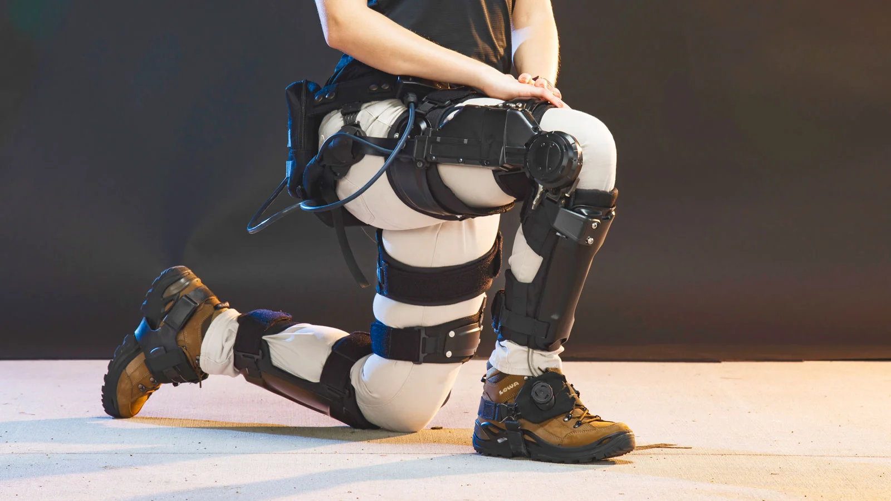

# NeuralGait

## Project Overview

## Objective

The goal of this project is to investigate how well a neural network can imitate human gait in a prosthesis. This involves not only examining “normal” gait but also comparing how the robot/controller and human react to perturbations, which are deviations from the normal gait.

## Input Combinations

The project aims to compare different input combinations to determine the most effective and efficient set of sensors for prostheses or exoskeletons. The input combinations include:

Using only the joint angle of the joint for which you are creating the controller.
Using all joint angles.
Combining joint angles with ground reaction force (GRF).
The hypothesis is that if only one joint angle is sufficient for accurate control, fewer sensors will be needed. This would make prostheses or exoskeletons cheaper and less prone to failure.

## Neural Network Models

To achieve the objective, the project implements and compares two types of neural network models:

Recurrent Neural Network (RNN)
RNNs are used to handle sequential data and capture temporal dependencies in the gait data.
The RNN model architecture includes LSTM layers to manage long-term dependencies and dropout layers to prevent overfitting.
The RNN model is trained on various input combinations to evaluate its performance in predicting joint moments.
Convolutional Neural Network (CNN)
CNNs are used to capture spatial patterns in the data, looking at the information at the current time point.
The CNN model architecture includes Conv1D layers for extracting features, followed by dropout layers and dense layers for prediction.
Similar to the RNN model, the CNN model is trained on the same input combinations for comparative analysis.
Implementation

## Data Preparation
Load and preprocess the gait data.
Normalize the data to ensure consistency and improve model performance.
Split the data into training and test sets.
Model Training and Evaluation
### RNN Model:

Extract data for the specified input combinations.
Train the RNN model and evaluate its performance using Mean Squared Error (MSE).
Save the trained RNN model and record its predictions and training history.
### CNN Model:

Extract data for the specified input combinations.
Train the CNN model and evaluate its performance using Mean Squared Error (MSE).
Save the trained CNN model and record its predictions and training history.
Comparison and Visualization
Compare the performance of both models across different input combinations.
Visualize the training and validation loss for both RNN and CNN models.
Plot the true values versus model predictions to assess accuracy.
Conclusion

By implementing and comparing RNN and CNN models with various input combinations, the project aims to determine the most efficient and effective sensor configuration for prostheses or exoskeletons. This will contribute to developing cost-effective and reliable assistive devices that can accurately mimic human gait and respond to perturbations